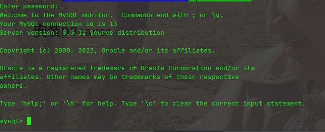
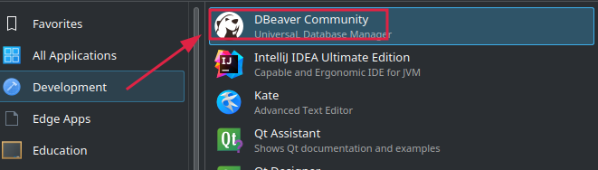
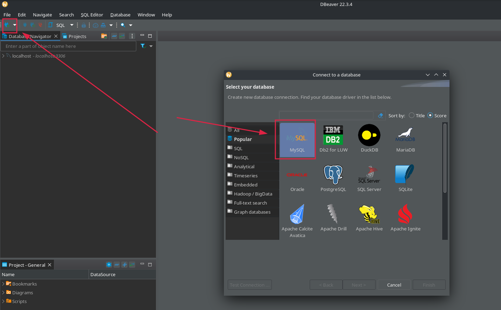

## 安装MySQL

```shell
sudo pacman -S mysql
```

执行完成后，控制台会提示你进行初始化：

```shell
sudo mysqld --initialize --user=mysql --basedir=/usr --datadir=/var/lib/mysql
```

初始化完成后，控制台会将创建的root用户的默认密码显示给你，复制保存。

启动MySQL服务：

```shell
sudo systemctl start mysqld.service
```

连接数据库：

```shell
mysql -uroot -p
```

回车后粘贴刚才保存的密码：



默认密码比较难记，可以使用命令修改root账户的密码：

```shell
ALTER USER 'root'@'localhost' IDENTIFIED BY '新密码';
```

## 安装DBeaver

```shell
sudo pacman -S dbeaver
```



打开运行，配置连接：



输入密码，连接即可，过程中可能会询问你是否要下载驱动，同意即可。