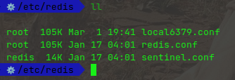
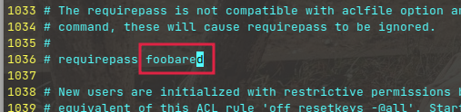
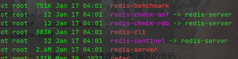
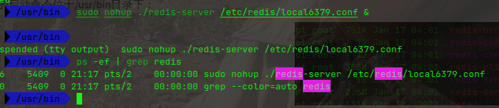
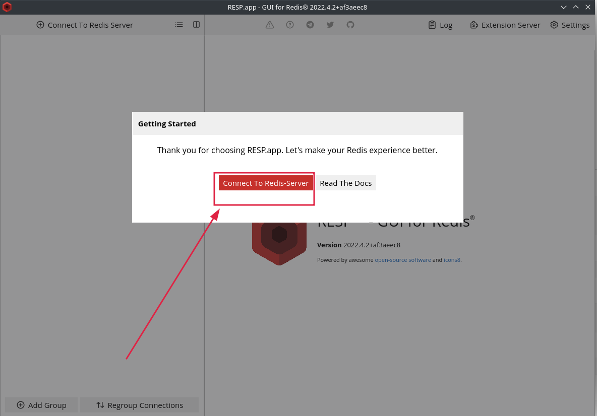
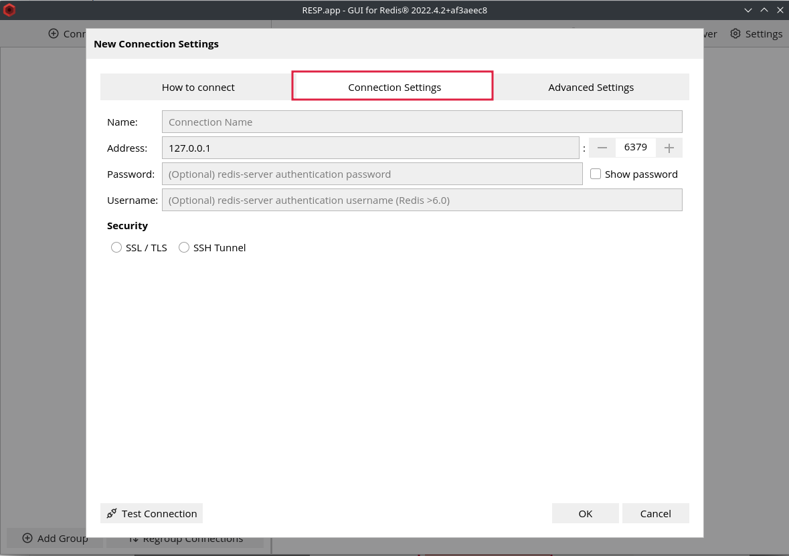
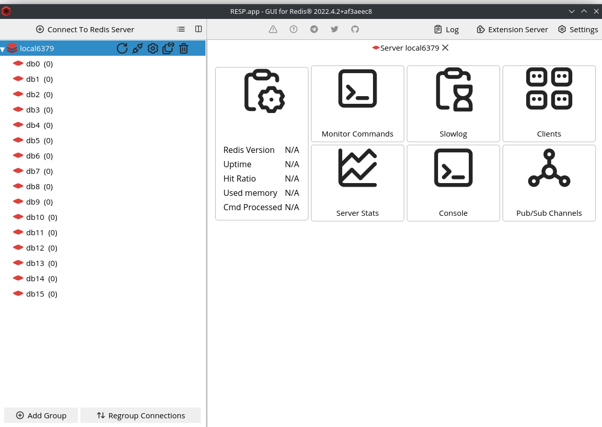
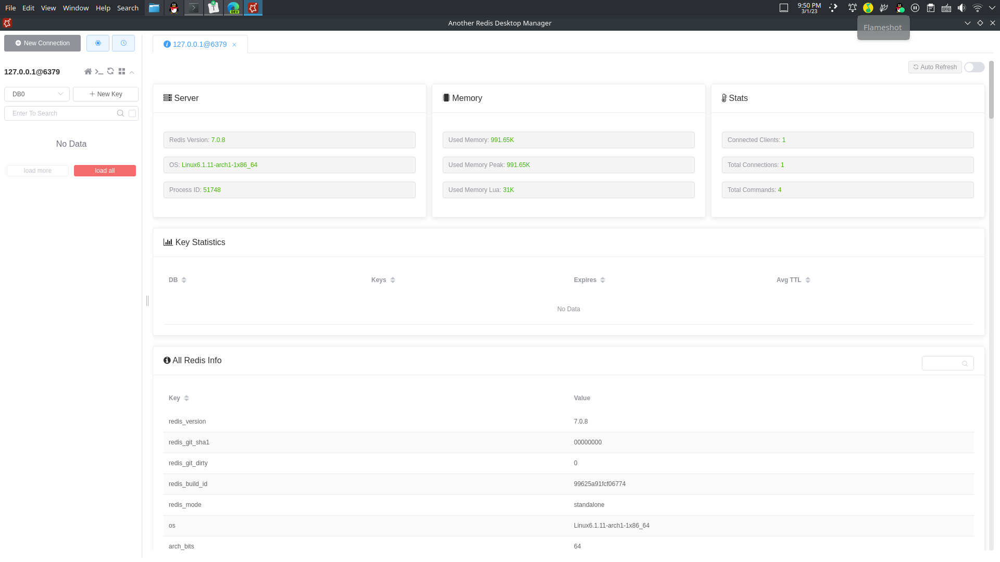

## 安装Redis

安装命令：

```shell
sudo pacman -S redis
```

安装好后的Redis配置文件位于/etc/redis：



> 这里的local6379.conf是我新建的配置文件

给Redis配置密码，新建一个配置文件，原来的作为备份：

```shell
cd /etc/redis
cp redis.conf ./local6379.conf
vim local6379.conf
```

搜索`requirepass`，将`foobared`修改为你想设置的密码：



安装后的启动命令位于/usr/bin目录下：



以我们编辑的配置文件在后台启动Redis服务：



## 安装Snap

目前Github上提供的下面两种软件安装方式都是使用Snap，如果你还没有安装Snap，需要先安装：

```shell
git clone https://aur.archlinux.org/snapd.git
cd snapd
makepkg -si
```

这里可能由于网络原因，编译安装失败，我们可以使用pacman直接安装：

```shell
sudo pacman -S snapd
```

启动snapd socket，将snapd进行链接：

```shell
sudo systemctl enable --now snapd.socket
sudo ln -s /var/lib/snapd/snap /snap  	# 这样我们就可以在/snap目录下看到我们通过它安装的软件
```

## 安装Redis DeskTop Manager

安装Redis DeskTop Manager:

```shell
sudo snap install redis-desktop-manager
```

运行Redis DeskTop Manager：

```shell
cd /snap/bin
sudo ./redis-desktop-manager.resp
```



输入密码，连接即可：





## 安装Another Redis DeskTop Manager（推荐）

同样也是使用Snap安装：

```shell
sudo snap install another-redis-desktop-manager
```

运行：

```shell
cd /snap/bin
./another-redis-desktop-manager
```

