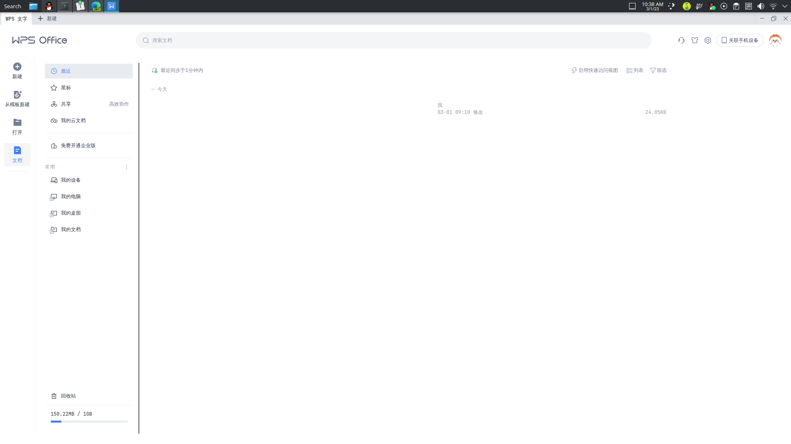
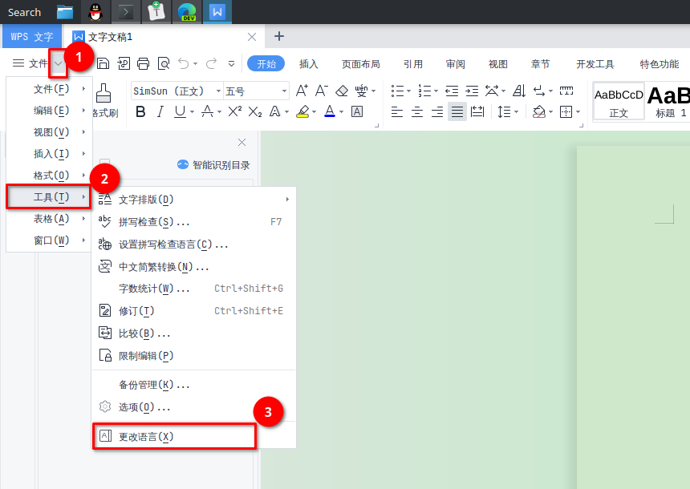
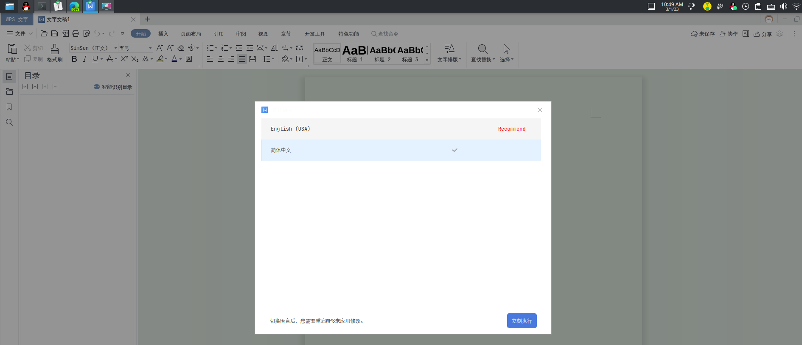
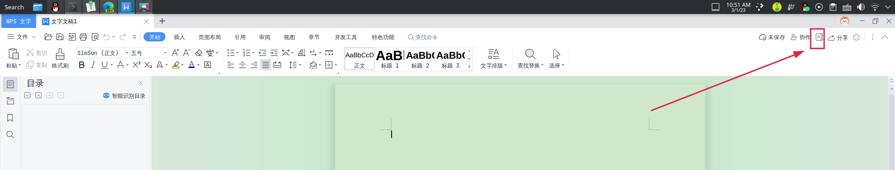
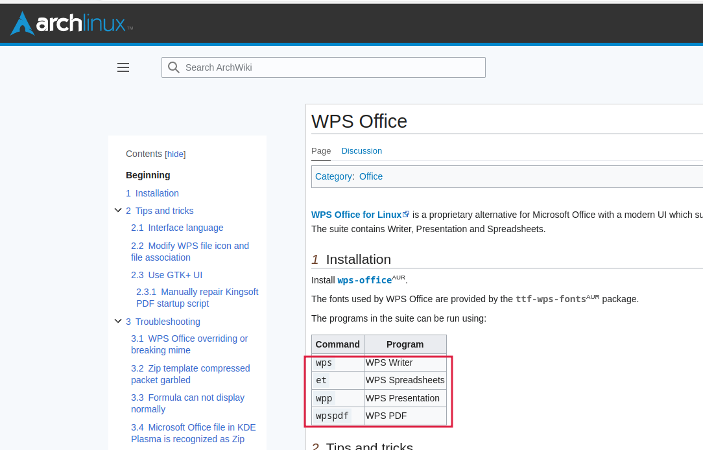
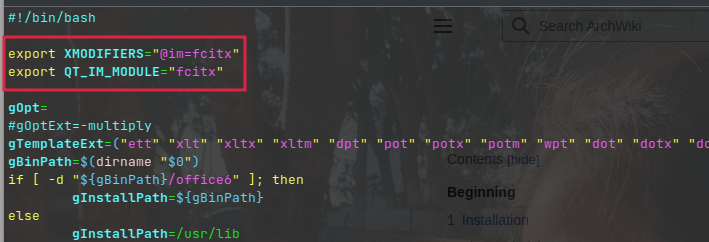

安装命令：

```shell
yay -S wps-office-cn ttf-wps-fonts // 安装wps以及相关字体
```

> 我的系统语言是English，所以要让wps使用中文界面，还需要安装中文字体
>
> ```shell
> pacman -S wps-office-mui-zh-cn 
> ```



如果进来不是中文，并且已经安装了中文字体，可以更改语言。首先新建或打开一个文件：



> 注意第一步点的是文件旁边的下拉三角



如果没有简体中文选项，可以尝试退出WPS后将上面的安装中文字体命令重新执行一遍

> 另外一种调出这个更改语言页面是：
>
> 
>
> 也是在新建或打开一个文件之后，才会有这个A的图标

-----

系统语言是English，在使用是还有一个问题，可能无法输入中文。这里我安装的是fcitx5中文输入法，要想WPS可以输入中文，需要在以下三个文件加入一段代码：

```shell
sudo vim /usr/bin/wps
sudo vim /usr/bin/et
sudo vim /usr/bin/wpp
```

这三个文件分别对应着World、Excel、PPT：



在这三个文件加入：

```shell
export XMODIFIERS="@im=fcitx"
export QT_IM_MODULE="fcitx"
```



修改后重启电脑即可