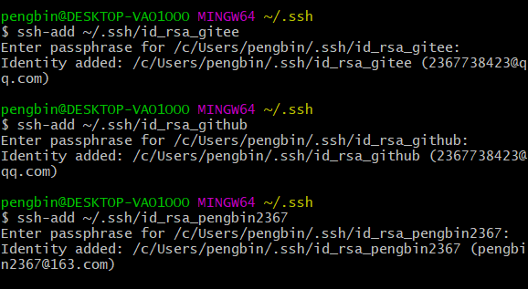

# Windows下配置多个Git帐号共存

> 以配置三个邮箱共存为例：
>
> Gitee帐号：  2367738423@qq.com    PengZong888      PengBin	海上
>
> Github帐号：2367738423@qq.com    PengZong666	  pengbin	肖申克
>
> Github帐号：pengbin2367@163.com pengbin2367		QingKe	  小孩

## 1. 清除已经存在的全局用户名和邮箱（如果存在的话）

```bash
git config --global --list  			// 看一下是否配置过user.name 和 user.email
git config --global --unset user.name 	 // 清除全局用户名
git config --global --unset user.email   // 清除全局邮箱
```


## 2. 删除已经生成过的密钥


## 3. 生成新的密钥

```bash
ssh-keygen -t rsa -C "pengbin2367@163.com"
```

首先输入你要的密钥文件名（如id_rsa_pengbin2367）、其次输入你的Git密码、确认密码

> 中间出现操作失误，按 CTRL+Z 取消


## 4. 添加公钥到远程仓库

生成的密钥文件中，以`.pub`结尾的为公钥文件，这里以Gitee添加公钥为例：


打开id_rsa_gitee.pub文件，讲内容粘贴到SSH公钥配置即可。

## 5. 配置密钥管理文件

> ```
> vim config	// 新建config文件
> // 将下列内容写入config文件
> #gitee
> Host gitee.com
> User PengBin
> HostName ssh.gitee.com
> PreferredAuthentications publickey
> IdentityFile ~/.ssh/id_rsa_gitee
> 
> 
> #github:
> Host github_pengzong666
> User pengbin
> HostName ssh.github.com
> PreferredAuthentications publickey
> IdentityFile ~/.ssh/id_rsa_github
> 
> #github-pengbin2367
> Host github_pengbin2367
> User QingKe
> HostName ssh.github.com
> PreferredAuthentications publickey
> IdentityFile ~/.ssh/id_rsa_pengbin2367
> ```
>
> - Host ---------远端仓库的别名，简写 例如： 配置后 git@gitee.com 可以写为 git@gitee
>
> - HostName ---------远端仓库地址或IP（不支持配置端口）
> - User ---------仓库上的用户名
> - PreferredAuthentications ---------强制使用Publickey验证
> - IdentityFile ---------指向仓库私钥的绝对路径
> - Port ---------远端仓库端口，一般不需要设置，特殊情况除外

## 6. 添加私钥到本地

```bash
ssh -v git@gitee.com 	// 查看一下ssh连接情况
```

提示你是否继续连接，输入yes即可！

```
 // ssh-agent是一个linux命令，主要是用来管理密钥的。
 ssh-agent-s  // -s 生成Bourne shell 风格的命令输出
```

> 这一步可能出现问题，提示你echo agent：
>
> 
>
> 使用命令：
>
> ```bash
> eval `ssh-agent -s`  或者 eval "$(ssh-agent -s)"
> ```
>
> 

成功后，将私钥添加到本地：

```bash
ssh-add ~/.ssh/id_rsa_gitee
ssh-add ~/.ssh/id_rsa_github
ssh-add ~/.ssh/id_rsa_pengbin2367
```



添加过程会让你输入对应帐号的密码，输入后回车即可！

> 这个过程中，如果提示你没有权限，可以将`.ssh`目录下的两个host文件删除后重新添加

最后，可以使用命令查看私钥是否配置成功：

```bash
ssh-add -l
```


## 7. 测试仓库连接

```
ssh -T git@gitee.com
ssh -T git@github_pengzong666
ssh -T git@github_pengbin2367
```

## 8. 给指定仓库添加git用户

使用命令查看当前仓库的本地状态：

```bash
git config --local --list
```


可以看到没有username和email两项，我们可以给它添加一个已有的用户：

git config --local user.name pengbin

git config --local user.email 2367738423@qq.com

git config --local --list


接着使用命令：

```bash
git add . 	// 将本地所有修改提交到暂存区
git commit -m test_pengzong666   // 将暂存区的内容提交到git
git push origin master 		// 将本地推送到git仓库
```

> 其它命令：
>
> ```bash
> git remote add origin git@github_pengzong666:pengzong666/qingke.git	// 使用配置的github_pengzong666用户连接到远程的pengzong666/qingke仓库
> git push -f origin master	// 强制推送到远程仓库
> ```


