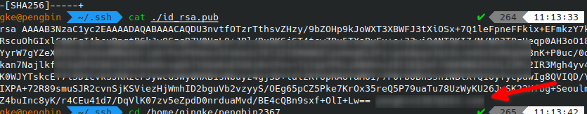
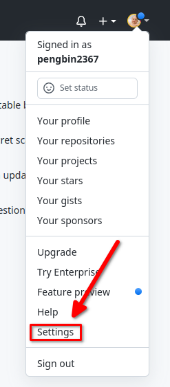
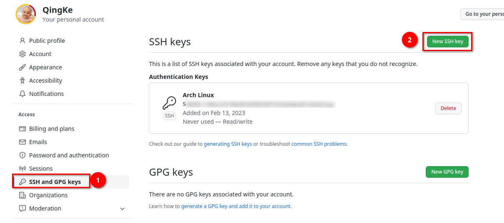
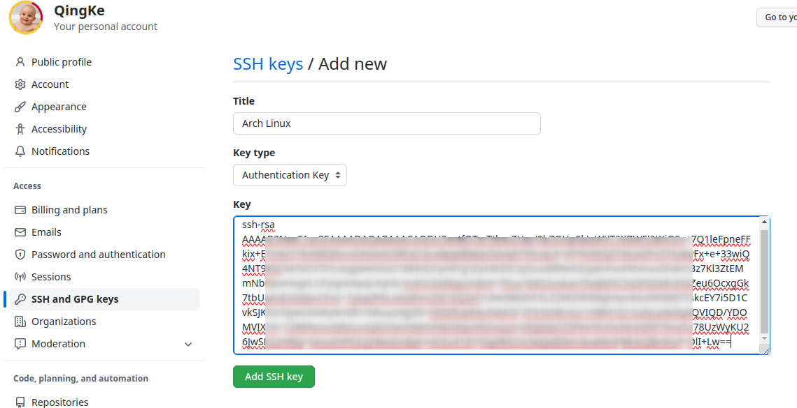

安装Git：

```bash
sudo pacman -S git
```

> 下面是对Git进行全局配置（也就是单用户配置）
>
> 以用户名`pengbin`，邮箱`pengbin@qingke.com`为例

### 1. 配置用户信息

```bash
git config --global user.name pengbin
git config --global user.email pengbin@qingke.com
```

### 2. 生成密钥

```bash
ssh-keygen -t rsa -b 4096 -C pengbin@qingke.com
```

参数解释：

- `-t rsa`：指定密钥的类型为rsa
- `-b 4096`： 指定密钥的长度
- `-C pengbin@qingke.com`：为密钥添加注释‘pengbin@qingke.com’用于识别密钥

> 按下回车后执行命令，此时，会询问你密钥文件名称，默认即可；接下来，会让你输入密码以及确认密码！！！**`千万不要输密码`**！！！如果你在这里输了密码，那么后面你对git的push操作都需要输入密码，没有实现免密操作。

### 3. 获取公钥并在GitHub上配置

默认生成的密钥文件在你的用户根目录下的`.ssh`目录，使用cat命令得到公钥复制到GitHub上：

```bash
cat ~/.ssh/id_rsa.pub
```

> `.pub`结尾的就是公钥，在复制的时候，双等号最后的内容是你生成密钥时候添加的注释，这个不用复制（也就是复制从`ssh-rsa`到`==`的内容即可）









> 至此，我们就已经配置好了，可以正常使用了！